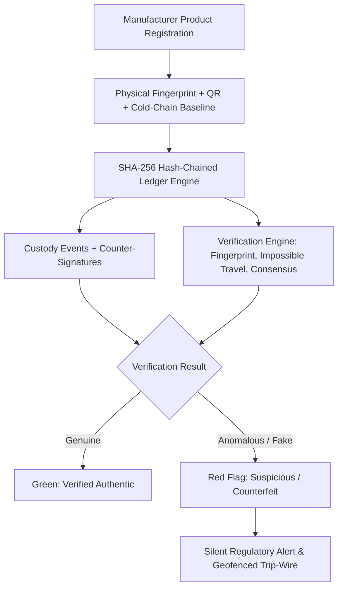

# TrustChain 🔗🛡️

**A Physically-Fused, Self-Alerting Hash-Chained Ledger for Verifying High-Value Supply Chains**

---

## 📌 Executive Summary

High-value physical goods—such as life-saving pharmaceuticals, luxury items, premium agricultural produce, and aerospace/critical spare parts—are routinely targeted by counterfeiters. Traditional anti-counterfeiting solutions rely on QR codes, printed holograms, or batch numbers. However, **cloned labels pass standard verification checks** because legacy databases only ask: *"Does this QR code exist in our database?"*

**TrustChain** closes this critical gap by binding the digital custody record to **unclonable physical and behavioral signals**. A copied QR code alone can never pass verification.

---

## 💡 The 4-Layer Trust Mesh

At every scan, TrustChain evaluates **four independent cryptographic & physical checks**. A unit is certified genuine only if all four agree:

1. **🔗 Cryptographic Hash-Chain Integrity**: SHA-256 append-only ledger ensuring every custody transfer (manufacture, transit, receipt, sale) is immutably linked to the genesis block.
2. **🔬 Packaging DNA Micro-Fingerprinting**: Perceptual hashing (`pHash`) of natural packaging micro-textures (fiber patterns, ink speckles, micro-perforations). A cloned QR code on a different package instantly fails fingerprint matching.
3. **🚨 Impossible-Travel Anomaly Engine**: Geo-velocity fraud detection logic applied to physical items. Flagging duplicate scans of the same unit occurring closer in time than physical transit speeds allow.
4. **👥 Swarm Counter-Signature Consensus**: Multi-signature ($k$-of-$n$ ECDSA) verification requiring nearby independent network actors (e.g., neighboring pharmacies/distributors) to counter-sign high-value custody handoffs.

---

## 🔥 Key Differentiators & Advanced Features

* **Cold-Chain-Fused Integrity**: Environmental sensor readings (temperature/humidity) are hashed directly into each custody block. Spoiled or heat-damaged products are cryptographically flagged and quarantined ("authentic but spoiled").
* **Silent Regulatory Trip-Wire**: When a counterfeit or chain break is detected, the UI does *not* tip off the fraudster at the point of sale. Instead, it fires a silent, background alert with precise GPS coordinates and batch history to regulatory authorities.
* **Community Micro-Bounty Trust Mesh**: Micro-incentives and crowdsourced trust scores for pharmacists and consumers reporting suspicious scans, creating an early-warning map of counterfeit activity.

---

## 🏗️ System Architecture



### 🧱 Block Data Structure

Each ledger block captures:
```json
{
  "index": 104,
  "product_id": "MED-789204-X",
  "event_type": "CUSTODY_TRANSFER",
  "actor_id": "DISTRIBUTOR_88",
  "geolocation": { "lat": 28.6139, "lng": 77.2090 },
  "timestamp": "2026-08-24T10:45:00Z",
  "sensor_data": { "temp_celsius": 4.2, "humidity_pct": 52 },
  "physical_fingerprint_hash": "a8f9c1...3b21",
  "counter_signatures": ["sig_actor1", "sig_actor2"],
  "previous_block_hash": "e3b0c44298fc1c149afbf4c8996fb92427ae41e4649b934ca495991b7852b855",
  "data_hash": "b2f6...SHA256(all_fields)"
}
```

---

## 🛠️ Technology Stack

| Layer | Technologies |
|---|---|
| **Backend & APIs** | Node.js, Express.js |
| **Database** | PostgreSQL |
| **Cryptography & Ledger** | Node `crypto` (SHA-256), ECDSA (Counter-Signatures) |
| **Physical Fingerprinting** | OpenCV / Perceptual Hashing (`pHash`) |
| **Frontends** | React + Tailwind CSS (Manufacturer / Distributor / Pharmacy Dashboards), PWA (Consumer Scan App) |
| **Geolocation Logic** | Haversine Distance + Timestamp Delta Anomaly Calculation |
| **Alerting & Notifications**| Webhooks / Twilio / SMTP |

---

## 📅 Development Roadmap (15-Day Sprint Plan)

* **Phase 1 (Days 1–4): Core Ledger Engine & Data Foundation**
  * PostgreSQL schema & SHA-256 hash-chain engine.
  * Tamper-proof verification tests & immutability validation.
* **Phase 2 (Days 5–8): Physical & Cold-Chain Integration**
  * REST APIs for registration, transfer, and retrieval.
  * pHash micro-fingerprint matching pipeline.
  * Sensor telemetry integration into block hashes.
* **Phase 3 (Days 9–10): Intelligence & Consensus Engine**
  * Geo-velocity impossible-travel engine.
  * Multi-signature ($k$-of-$n$) swarm consensus logic.
* **Phase 4 (Days 11–13): User Dashboards & Scan PWA**
  * Web dashboards for Manufacturer, Distributor, & Pharmacy.
  * Responsive Mobile/PWA scanner with live block journey timeline.
* **Phase 5 (Days 14–15): Regulatory Trip-Wire & Live Demo Harness**
  * Silent background alert dispatch system.
  * "Simulate Counterfeit" trigger for pitch & live demonstrations.

---

## 🎬 Live Demo Scenario

1. **Genuine Scan**: Scan authentic QR $\rightarrow$ Instant **Green "Verified Authentic"** with interactive lifecycle timeline.
2. **Counterfeit Simulation**: Click *"Simulate Counterfeit"* (Cloned QR with mismatched package micro-texture and impossible-travel timestamp) $\rightarrow$ Instant **Red Flag** + Silent background regulatory notification fired!
