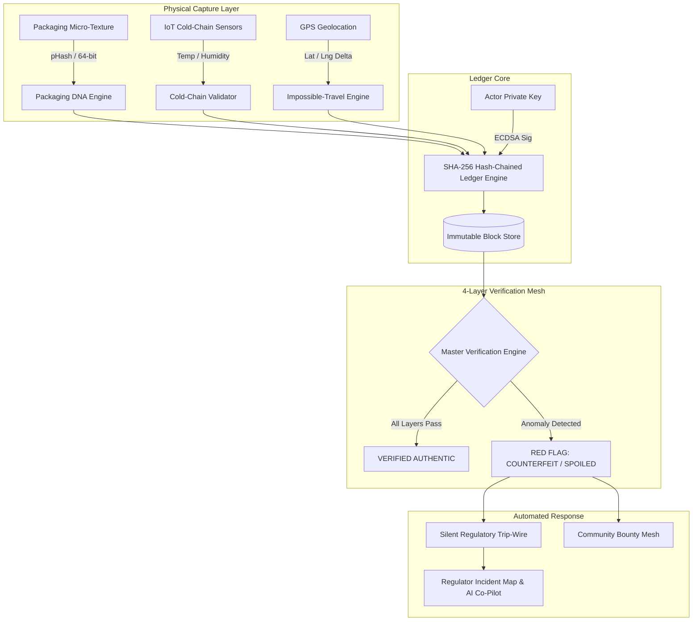

# 🛡️ TrustChain

**Physically-Fused, Self-Alerting Hash-Chained Verification Ledger for Anti-Counterfeiting in Critical Supply Chains**

[](https://trust-chain-gilt.vercel.app/)
[](https://github.com/sunraycodes/TrustChain)
[](https://github.com/sunraycodes/TrustChain)
[](https://github.com/sunraycodes/TrustChain)

---

## 🌐 Live Deployments

* **Frontend Web Application (Vercel)**: [https://trust-chain-gilt.vercel.app/](https://trust-chain-gilt.vercel.app/)
* **Backend API & Ledger Engine (Render)**: Hosted backend providing cryptographic verification, chain ledger, and AI endpoints.

---

## 📌 Executive Summary & The Problem

Over **1 in 10 medical products** in low- and middle-income nations are counterfeit or substandard (WHO). Counterfeit medications lead to treatment failure, antimicrobial resistance, and tragic loss of life. 

Traditional anti-counterfeiting solutions rely on static barcodes or QR stickers. **The fatal flaw**: standard databases only check *"Does this QR code exist in our database?"* Counterfeiters easily clone genuine labels and stick them on fake batches.

**TrustChain** solves this by cryptographically fusing the digital ledger record with **unclonable physical micro-textures, cold-chain sensor physics, geo-velocity bounds, and swarm consensus**. A cloned QR code alone can never pass verification.

---

## 💡 The 4-Layer Trust Mesh (+ Advanced Extensions)

At every custody handoff and consumer scan, TrustChain executes an autonomous verification pipeline under **500ms**:

```
+-------------------------------------------------------------------------------+
|                         TRUSTCHAIN 4-LAYER TRUST MESH                         |
+-------------------------------------------------------------------------------+
|  1. 🔗 Cryptographic Hash-Chain    |  Deterministic SHA-256 block ledger with |
|     Integrity                      |  parent-hash pointers and tamper check.  |
+------------------------------------+------------------------------------------+
|  2. 🔬 Packaging DNA Micro-        |  64-bit Perceptual Hash (pHash) of paper |
|     Fingerprinting                 |  fibers & ink speckles (Hamming <=10).   |
+------------------------------------+------------------------------------------+
|  3. 🚨 Impossible-Travel           |  Haversine distance vs. time delta       |
|     Geo-Velocity Engine            |  detection (>900 km/h physical anomaly). |
+------------------------------------+------------------------------------------+
|  4. 👥 Swarm Counter-Signature    |  k-of-n multi-signature consensus from   |
|     Consensus                      |  neighboring independent network nodes.  |
+------------------------------------+------------------------------------------+
|  ❄️ Cold-Chain-Fused Integrity     |  Environmental telemetry (temp/humidity) |
|                                    |  hashed into blocks (detects spoilage).  |
+------------------------------------+------------------------------------------+
|  🕵️ Silent Regulatory Trip-Wire    |  Instant background GPS dispatch to FDA/ |
|                                    |  police without tipping off fraudsters.  |
+------------------------------------+------------------------------------------+
|  🔒 Zero-Knowledge Proofs          |  zk-SNARK proof of authentic custody     |
|                                    |  without exposing confidential volumes.  |
+------------------------------------+------------------------------------------+
|  🤖 AI Regulatory Co-Pilot         |  Natural language assistant querying the |
|                                    |  live ledger and counterfeit heatmap.    |
+------------------------------------+------------------------------------------+
```

---

## 👥 Stakeholder Portals & User Roles

| Portal | Role | Key Capabilities |
|---|---|---|
| **📱 Consumer Scan PWA** | `CONSUMER` | Camera QR scanner, instant 4-layer trust analysis, interactive block journey timeline, and one-click *"Simulate Counterfeit"* pitch demo. |
| **🏭 Manufacturer Portal** | `MANUFACTURER` | Register new products/batches, capture substrate packaging DNA (8×8 bit blueprint), configure cold-chain limits, and append Genesis Blocks. |
| **🚚 Distributor Logistics** | `DISTRIBUTOR` | Record transit handoffs, log temperature/humidity readings, attach multi-sig signatures, and generate **Zero-Knowledge Proofs (zk-SNARKs)**. |
| **🏥 Pharmacy Dispensary** | `PHARMACY` | Confirm shipment arrival, execute cold-chain safety gate checks (2°C–8°C), and record patient dispensing events. |
| **🏛️ Regulatory Center** | `REGULATOR` | Live threat monitor, incident triage heatmap, automated silent trip-wire audit feed, and **AI Regulatory Co-Pilot**. |

---

## 🔑 Demo Login Credentials

For convenience during hackathon evaluation, the platform is pre-configured with demo accounts:

| Portal | Actor ID | Role | Demo Password |
|---|---|---|---|
| **Manufacturer** | `MANUFACTURER_ALPHA` | Manufacturer (AstraBiotech Pharma) | `password123` |
| **Distributor** | `DISTRIBUTOR_BETA` | Distributor (Global ColdChain Logistics) | `password123` |
| **Pharmacy** | `PHARMACY_GAMMA` | Pharmacy (Apex Central Pharmacy) | `password123` |
| **Regulator** | `REGULATOR_FDA` | Regulator (National Drug Safety Authority) | `password123` |
| **Consumer** | Public Access | Consumer Scan PWA | *No login needed* |

---

## 🎬 Step-by-Step Interactive Demo Walkthrough

### 1. Test Authentic Verification (Consumer PWA)
1. Open the [TrustChain Live App](https://trust-chain-gilt.vercel.app/).
2. On the **Consumer Scan PWA** tab, verify that Product ID `MED-789204-X` is loaded.
3. Click **"Verify Authenticity (Scan)"**.
4. Observe all 4 trust layers turn **Green ("VERIFIED AUTHENTIC")**, showing the full immutable custody history from factory to distributor to pharmacy.

### 2. Test Counterfeit Attack Simulation (The "Wow" Factor)
1. Click the red **"Simulate Counterfeit Attack"** button.
2. The engine simulates a cloned QR scan arriving from London (5,000+ km away instantly) with a mismatched packaging DNA substrate.
3. **Result**:
   - Immediate **Red Flag: COUNTERFEIT**.
   - Packaging DNA Layer highlights **Bit Mismatch** between baseline and cloned micro-texture.
   - Impossible-Travel Engine triggers **Geo-Velocity Anomaly Alert** (>5000 km/h).
   - **Silent Regulatory Trip-Wire** fires in the background with precise coordinates.

### 3. Inspect Regulatory Command Center & AI Co-Pilot
1. Switch to the **Regulator Portal** tab (sign in with `REGULATOR_FDA` / `password123` or select from dropdown).
2. Review the **Incident Triage & Alert Heatmap** showing the newly logged critical counterfeit attempt.
3. In the **AI Regulatory Co-Pilot** box on the right, click suggested queries or type:
   - *"How many counterfeits were detected?"*
   - *"Where are the hotspot locations?"*
   - *"Which product is most targeted?"*

### 4. Test Zero-Knowledge Proof Generation
1. Switch to the **Distributor Portal** (sign in with `DISTRIBUTOR_BETA` / `password123`).
2. Scroll to the **Zero-Knowledge Proof Generator** card.
3. Click **"Generate ZK Proof"**.
4. Observe the interactive zk-SNARK Groth16 witness construction certifying authentic custody without revealing commercial volumes or supply routes.

---

## 🏗️ System Architecture & Data Flow



### Ledger Block Schema
```json
{
  "block_index": 1,
  "product_id": "MED-789204-X",
  "event_type": "CUSTODY_TRANSFER",
  "actor_id": "DISTRIBUTOR_BETA",
  "latitude": 28.7041,
  "longitude": 77.1025,
  "location_name": "Delhi Cold Chain Hub, India",
  "timestamp": "2026-08-28T14:32:00.000Z",
  "temp_celsius": 4.5,
  "humidity_pct": 52.0,
  "fingerprint_hash": "a8f9c13b21e45678",
  "counter_signatures": ["sig_distributor_beta_key", "sig_peer_node_88"],
  "previous_block_hash": "c5f1a92e8471b002de9f0183b6c20894589d84126c8b054238e2197127e7f1aa",
  "data_hash": "e4a2d890bc178491cba03891726a8f1092837418293749182374981723948172"
}
```

---

## 🛠️ Technology Stack

* **Frontend**: React 18, Tailwind CSS, Lucide Icons, Vite, HTML5 Canvas QR Scanner (`jsQR`).
* **Backend & API**: Node.js, Express.js, JWT Authentication, CORS.
* **Cryptography & Math**: SHA-256 Ledger Hashing (`crypto`), 64-bit Perceptual Hashing (`pHash`), Hamming Distance Matcher, Haversine Geo-Velocity Calculations.
* **Zero-Knowledge Simulation**: Groth16 zk-SNARK proof verification framework.
* **Database & Persistence**: Structured storage engine with disk snapshotting & checkpoint verification.
* **Deployment**: Vercel (SPA Frontend) + Render (Node.js API Engine).

---

## 💻 Local Development Setup

### Prerequisites
- Node.js (v18 or v20+)
- npm (v9+)

### Installation & Running Locally

1. **Clone the repository**:
   ```bash
   git clone https://github.com/sunraycodes/TrustChain.git
   cd TrustChain
   ```

2. **Install all dependencies**:
   ```bash
   npm run install:all
   ```

3. **Start both Frontend and Backend concurrently**:
   ```bash
   npm run dev
   ```
   - **Client**: `http://localhost:5173`
   - **API Server**: `http://localhost:5000`

4. **Run the Automated Test Suite**:
   ```bash
   npm test --prefix server
   ```

---

## 🧪 Automated Test Verification

TrustChain includes a comprehensive test suite validating cryptographic ledger immutability and physical packaging DNA matching:

```bash
$ npm test --prefix server

▶ TrustChain Ledger Engine Integrity Suite
  ✔ 1. Genesis block creation and chain validation
  ✔ 2. Appending custody blocks and verifying unbroken chain
  ✔ 3. Single-field tamper detection test (tampering breaks SHA-256 pointer)
✔ TrustChain Ledger Engine Integrity Suite (4.5ms)

▶ Packaging DNA & Perceptual Hash Engine Suite
  ✔ 1. Normalization and 64-bit binary expansion
  ✔ 2. Authentic identical DNA evaluates to 100% similarity
  ✔ 3. Minor sensor noise (1-2 bit flips) maintains authentic status (>85%)
  ✔ 4. Counterfeit / cloned packaging DNA triggers mismatch (<85%) and clone alert
  ✔ 5. Perceptual hash computation from base64 image strings
✔ Packaging DNA & Perceptual Hash Engine Suite (2.6ms)

ℹ tests 10 | pass 10 | fail 0
```

---

## 🌐 Deployment Configuration Guide

### Vercel (Frontend)
- **Framework Preset**: Vite
- **Root Directory**: `client`
- **Build Command**: `npm run build`
- **Output Directory**: `dist`
- **Environment Variable**: `VITE_API_URL` set to your Render backend URL (e.g. `https://trustchain-api.onrender.com` or local fallback `/api`).

### Render (Backend API)
- **Environment**: Node.js
- **Root Directory**: `server` (or repository root with `node start.js`)
- **Build Command**: `npm install`
- **Start Command**: `node src/index.js`
- **Environment Variables**:
  - `PORT`: `5000` (or dynamic `$PORT`)
  - `NODE_ENV`: `production`
  - `JWT_SECRET`: `trustchain_production_secret_omnikon_2026`

---

## 🏆 Hackathon Submission Checklist

- [x] **Core Ledger Engine**: SHA-256 immutable block creation & single-field tamper detection.
- [x] **Packaging DNA Engine**: 64-bit pHash comparison & 8×8 bit visual blueprint.
- [x] **Impossible-Travel Engine**: Real-time geo-velocity physics calculations.
- [x] **Swarm Multi-Sig Consensus**: Counter-signature verification for custody transfers.
- [x] **Cold-Chain-Fused Hashes**: Temperature/humidity telemetry integration with spoilage flags.
- [x] **Silent Regulatory Trip-Wire**: Background alert channel with incident geo-coordinates.
- [x] **Zero-Knowledge Proofs**: zk-SNARK authentic custody proof generator.
- [x] **AI Regulatory Co-Pilot**: Interactive intelligence assistant for threat analysis.
- [x] **Role-Based Portals**: Manufacturer, Distributor, Pharmacy, Regulator, & Consumer PWA.
- [x] **Live Deployments Verified**: Vercel frontend and Render backend operational.

---

## 📄 License & Attribution
Developed for **OMNIKON 2026 Hackathon** (Problem Statement: `OMNI_CYBERTECH_5`).  
Licensed under the **MIT License**.
